# 项目初始化
```bash
mkdir {leetcode,spec,tutorial,misc,stdlib,tool,framework,pattern}
cd leetcode
go mod init github.com/24king/go-learn/leetcode
cd ../spec
go mod init github.com/24king/go-learn/spec
cd ../tutorial
go mod init github.com/24king/go-learn/tutorial
cd ../misc
go mod init github.com/24king/go-learn/misc
cd ../stdlib
go mod init github.com/24king/go-learn/stdlib
cd ../tool
go mod init github.com/24king/go-learn/tool
cd ../framework
go mod init github.com/24king/go-learn/framework
cd ../pattern
go mod init github.com/24king/go-learn/pattern
```
# 工作空间初始化
```
go work init ./leetcode
go work init ./spec
go work init ./tutorial
go work init ./misc
go work init ./stdlib
go work init ./tool
go work init ./framework
go work init ./pattern
```

# 规范 
* 文件夹名称和包名尽量保持一致
* 预期方法名需要包括注入Typing的分类信息,方便方法的检索

```plantuml
@startgantt
language zh
title 2022年27周
caption Go学习
printscale daily zoom 4
today is colored in #AAF
hide footbox

Project starts 2022-07-01
[集成plantuml] starts 2022-07-02
[集成plantuml] lasts 2 day
[集成plantuml] is 100% completed
[leetcode] starts 2022-07-02
[leetcode] is 0% completed
[leetcode] lasts 14 day
[spec] starts 2022-07-02
[spec] is 20% completed
[spec] lasts 14 day
[集成inbox.md] starts 2022-07-02

-- 待办 --
[tutorial] starts 2022-07-02
[tutorial] is 0% completed
[tutorial] lasts 14 day

[Go错误机制] starts 2022-07-03
[Go错误机制] is 20% completed
[Go错误机制] lasts 5 days

-- 收集 --
[集成plantuml-本地化] starts 2022-07-03
[集成plantuml-本地化] lasts 3 day
[集成plantuml-本地化] is 0% completed
[Go反射] starts 2022-07-03
[Go反射] is 0% completed
[Go反射] lasts 5 day
[Go依赖注入] starts 2022-07-05
[Go依赖注入] is 10% completed
[Go依赖注入] lasts 5 day
[Gin-Context] starts 2022-07-07
[Gin-Context] is 0% completed

@endgantt
```




### Go依赖注入
发现我要使用awx控制端访问远端服务,为了避免代码重复,一种使用单例模式,一种使用依赖注入框架,wire