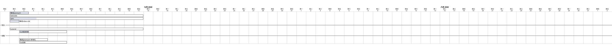

# 项目初始化
```bash
mkdir {leetcode,spec,tutorial,misc}
cd leetcode
go mod init github.com/24king/go-learn/leetcode
cd ../spec
go mod init github.com/24king/go-learn/spec
cd ../tutorial
go mod init github.com/24king/go-learn/tutorial
cd ../misc
go mod init github.com/24king/go-learn/misc
```
# 工作空间初始化
```
go work init ./leetcode
go work init ./spec
go work init ./tutorial
go work init ./misc
```

# 规范 
* 文件夹名称和包名尽量保持一致
* 预期方法名需要包括注入Typing的分类信息,方便方法的检索


